# 将军的荣耀3新玩法设计- 生涯（Career）模式

这个新模式主要是借鉴一些战术级（以班组为单位）兵棋中常见的指挥一些单位经历一系列随机战斗的模式。战术级与采用类似的继承单位设定的 Panzer Corps，终极将军的历史向关卡区别在于关卡是重度随机化的，因为班组级战斗通常缺乏历史细节。

特性：

- 玩家控制单位经历8场随机战斗。
- 随机战斗采用随机地图与随机的单位配置，而非简单的抽取一个已有剧本。
- 每场战斗中单位继承到下次战斗中。
- 玩家可在每次战斗前使用“政治点数”从随机生成的单位池中购买新单位（可能仍需要若干回合才能部署），在战斗中获得额外的补给和补充点数（金币/经济），解散单位回收部分政治点数。
- 玩家指定最多40个特种部队和将领构成卡组，随进度推进发放给玩家。
- 战斗中部署单位的补给和补充单位所消耗的经济随机化（-25% ~ +100%），和上一条一同鼓励平衡编组与多样化的战斗体验，而非不断重复最优解。
- 战斗中未达成目标仍可以继续，只是无法获得政治点数奖励。实际上，玩家应该鉴别“不可能的任务”并及时止损。
- 玩家最终凭借剩余的政治点数数量决定胜负与取胜程度。

设计与其他游戏中类似模式的粗略的对应：

- 经济 = 补充点数
- 补给 = 因补给造成的部署限制
- 政治点 = 胜利点（胜利点判定胜利程度，胜利点换援军等）

## 战斗外的UI

界面设计文件见 [Figma](https://www.figma.com/file/gDWyb7ztmz0QcHmx96oAXr/Glory-of-General-3-Expansion?type=design&node-id=0%3A1&mode=design&t=Is0gZ3CPD2f7D8ZK-1) 链接（其中 Original 开头的 frames 为粗略复刻当前界面，为了对比或者风格统一。其他 frames 均用于新设计。部分交互可以用 prototypes 查看）。

从主界面 CAREER 进入：

当第一次进入此模式或重启时，选择一个国家作为控制国家：

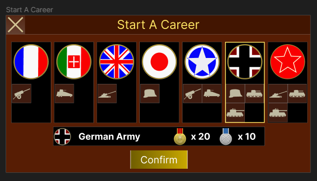

通关奖励对标征服，陆战[劣势方](https://tieba.baidu.com/p/8170393417)奖励略多一些，参考值：

|        | 法国 | 意大利 | 英国 | 日本 | 美国 | 德国 | 苏联 |
| ------ | ---- | ------ | ---- | ---- | ---- | ---- | ---- |
| 突击章 | 13   | 15     | 14   | 12   | 11   | 10   | 10   |
| 骑士章 | 26   | 30     | 28   | 24   | 22   | 20   | 20   |

首次通关后再次选择该方奖励减半。

首次进入该模式或点击生涯模式主界面的卡组按钮时进入卡组构建界面：

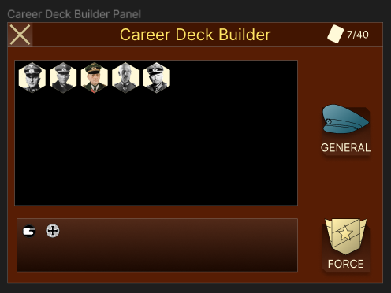

该界面显示卡组中的将军与特种部队的缩略图，点击对应按钮使用已有UI进行将军与特种部队的选择与解选择：

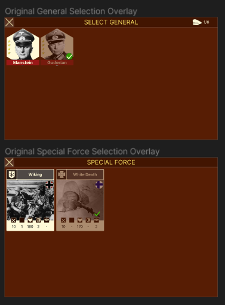

当卡组编辑不可用时，两按钮为灰且不响应。

首次进入在卡组构建完成后进入生涯模式主界面。否则点击主界面时总是进入生涯模式主界面：

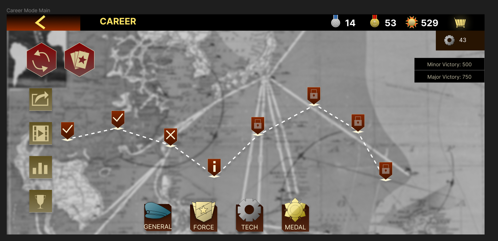

- 第一次进入或重启后，点击第一个战斗按钮前称为“未初始化状态”，点击之后称为“已初始化状态”。
- 初始化时（每次生涯模式以未初始化状态点击第一个战斗按钮时），采样确定本次生涯模式所有关卡数据，抽卡顺序等。（SL无效）。
- 主界面左上会输按钮可重启生涯模式（选择国家等）
- 左上卡组按钮打开卡组构建界面，但仅能在未初始化状态可修改卡组状态，已初始化状态下仅能查看当前卡组构成。
- 已初始化状态分为“战斗前”和“战斗中”状态
    - 完成上一次战斗而未开始下一次战斗时，为战斗前状态。
    - 从战斗界面退出时，处于战斗中状态。
- 关卡符号
    - 勾：达成目标的关卡
    - 叉：未达成目标的关卡
    - 感叹号：当前关卡
    - 锁：当前关卡之后的关卡
- 战斗中状态点击类似战役的感叹号标记时，进入对应战斗自动保存的状态。战斗前时则打开战斗状态简报界面：

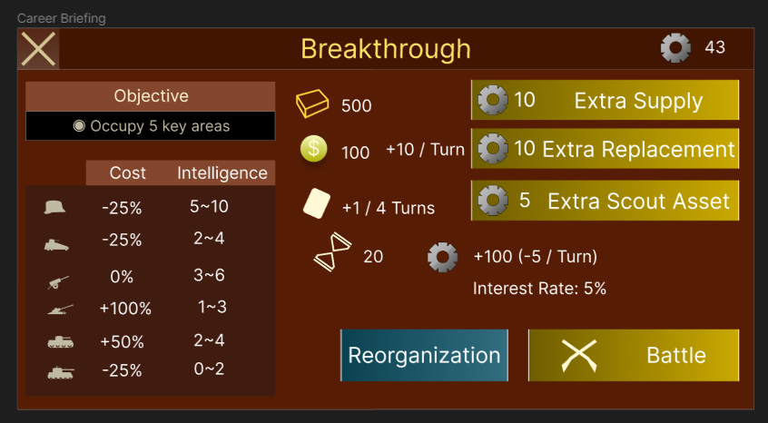

界面中显示了

- 本战斗的初始补给
- 初始经济和固定回合经济增加（生涯模式中战斗中占领城市等不增加经济，可能增加政治点）
- 抽卡间隔（与战斗总回合有关，每场战斗在总回合限制内均匀抽5张卡，若战斗结束时仍未抽满该战斗“该”抽的卡时一次性抽完）。
- 总回合与政治点数奖励，时间惩罚和利率（未使用的政治点数产生“利息”）。
- 各个单位类型的部署（类似普通战役中使用补给放到场上）与兵力补充的经济消耗的修正系数（软性地产生不同的兵力构成风味）。
- 对方兵力构成的情报（辅助决策利用政治点购买什么兵种，判断总体难度决定总体战术，是否提前撤退等。）

右边的三个选项可以

- 利用政治点获得额外的补给点数/经济（+50%），该选项可以再次点击撤销。
    - 不存在政治点与战斗内的经济与补充的直接对应，仅能通过以上方式选择性增加。
    - 战斗结束时剩下的经济，补给等没有回报。
    - 通常提前结束战斗增加的政治点数比拖回合获得经济补充兵力的优势更大。
- 更精确的情报，未启用时误差更大。

情报噪声可以使用贝叶斯方法，如实际值X的先验取为 0~100 的等概率离散分布，观测模型增加加性噪声与乘性噪声并截断： $Y=\max(0, kX+\epsilon), \quad k \sim LN(\mu_k,\sigma_k^2),\quad \epsilon\sim N(\mu,\sigma^2)$ 。其中  $N,NP$ 分别为正态分布与[对数正态分布](https://en.wikipedia.org/wiki/Log-normal_distribution)。在初始化时每个战斗以真实值（战斗敌方某类兵种的实际数量）与观测模型生成 $n$ 个观测值，其中 $n_1$ 个用于计算不使用额外侦察资产时的后验分布， $n$ 个则用于计算使用时的后验分布。后验分布与99%概率范围的确定使用标准的离散分布处理方法即可。

样例数据：

- $\sigma_k=1/2$,
- $\mu_k=\exp(-\sigma^2/2)$: 期望为1约束。由此，乘性噪声95%区间为 0.33~2.35
- $\sigma=3$
- $\mu=0$，由此，加性噪声 95% 区间为 -5.87~5.87
- $n=16$
- $n_1=4$: 粗略来说更多情报会精确一倍。

重组按钮可以打开重组界面：

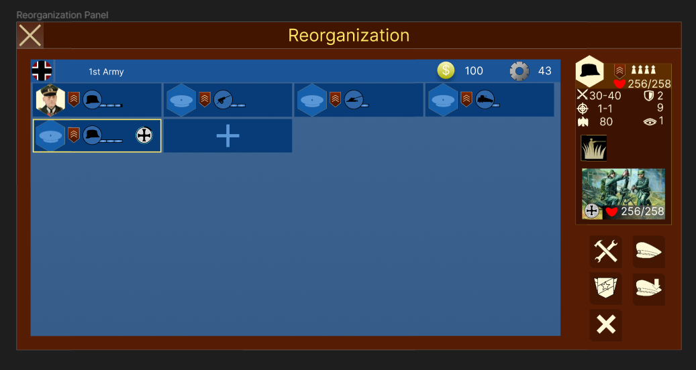

- 以类似集团军的方式显示玩家当前所持有的单位
    - 灰底色，有回合标记的单位表示战役中在若干回合后解锁的单位。该类单位不能进行除了解散以外的操作。
- 补充，征募等操作使用战斗初始时的经济
- 消耗政治点数解除将军指派

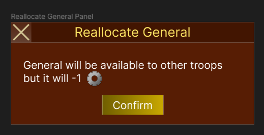

- 解散单位增加少量政治点：

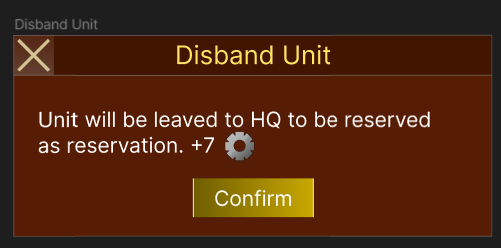

回收与可购买的随机单位政治点基准消耗与其他模式的对应关系：

|          | 经济 | 战役参考补给消耗 | 联合战线 | 生涯基准政治点 | 生涯补给消耗 | 生涯单位损失 |
| -------- | ---- | ---------------- | -------- | -------------- | ------------ | ------------ |
| 步兵     | 10   | 20               | 6        | 5              | 20           | 1            |
| 装甲车   | 20   | 40               | 9        | 10             | 40           | 2            |
| 炮兵     | 18   | 40               | 9        | 10             | 40           | 2            |
| 坦克     | 36   | 60               | 12       | 18             | 60           | 3            |
| 重炮     | 32   | 60               | 12       | 16             | 60           | 3            |
| 重坦     | 50   | 100              | 15       | 25             | 100          | 5            |
| 特种部队 |      | 20               |          | 5              | 0            |              |

- 政治点消耗大致是经济除以2，补给消耗与战役的消耗对齐。
- 特种部队不消耗补给，代价移到单位求援的政治点消耗上。
- 残编的定价
    - 非 100% HP 编制的价值为其满编时价值乘以HP比例
    - 特种部队的剩余 HP 为特种部队价值乘以其HP比例
- 回收时得到的政治点为其基准政治点价值除以2，向上取整计算。

关联的政治点增减节点

- 将将军从指派的单位上释放：-1 政治点
- 战斗中单位完全损失：损失表中指定的点数

### 求援界面

点击重组界面中类似集团军的增加单位框时打开求援（购买单位）界面：

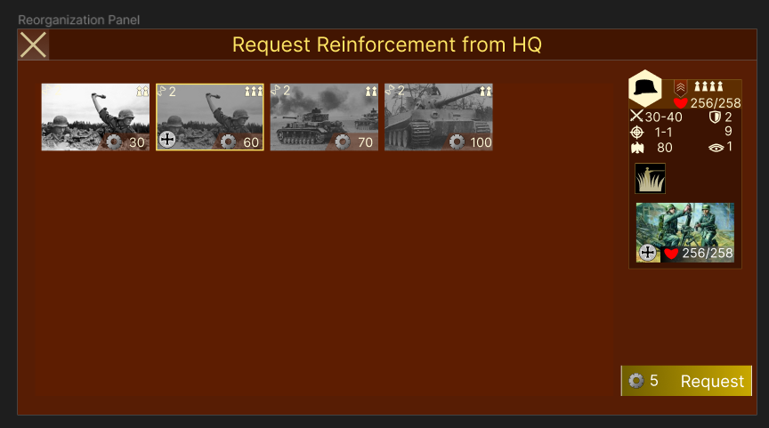

该界面中可以使用政治点购买随机单位。

- 可购买单位数量：5~10，均匀概率。
- 单位类型按顺序抽取：
    - 基准权重
        - 步兵：6
        - 装甲车：3
        - 炮兵：3
        - 坦克：3
        - 重炮：2
        - 重坦：2
    - 当玩家当前未持有该类单位且当前池中尚未抽出此类单位：+2
- 单位编数为 1~无将时最大编制的均匀概率取值。(总是满HP)
- 单位有25%概率带有特种部队，特种部队类型为当前所有类型匹配的特种部队均匀抽出。
- 单位有50%概率可立即到达，有50%概率在2~最大回合数时间内到达。
- 单位的定价为基准政治点消耗乘单位类型价格修正向上取整
- 单位类型价格修正对每个战斗每个单位类型分别采样：
    - 75%：20%
    - 100%：40%
    - 150%：20%
    - 200%：20%
- 选择单位时显示对应数据，若政治点不足则请求支援按钮为灰且不可交互，否则为正常颜色且可以点击。点击后单位从池中移除，移入玩家当前所持有的单位中。
- 不能立即到达的单位即使没有部署，在下一次战斗时（不管上一次战斗总共消耗多长回合）也处于正常状态而非等待到达的状态。

## 战斗界面

在简报界面点击战斗按钮进入类似战役的战斗界面：

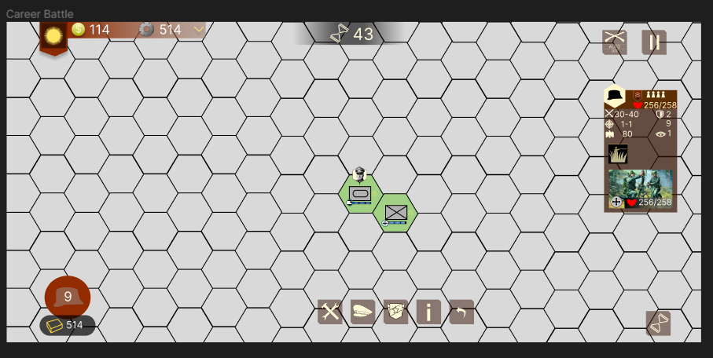

- 战役追踪政治点数变化，战斗中虽然造成政治点数的变化，但政治点数本身没有方式直接影响战斗（只能在开始战斗前影响）。
- 在 ⌊TotalTurn / 5⌋ 回合开始时，从卡组中抽一张卡（增加一个将军或特种部队选项）：

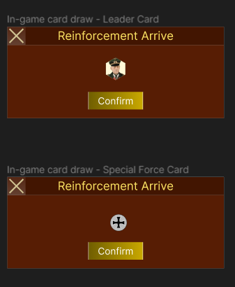

- 卡组中不满40张卡时，以“占位卡”补齐。抽到占位卡时：
    - 50% 概率抽到特种部队，除卡组中已有的特种部队外，所有特种部队以等概率抽到（0强化）。
    - 50% 概率抽到随机将领，除卡组中已有将另外，按以下权重抽到将领（0强化）
        - 4星：1
        - 3星：2
        - 2星：4
        - 1星：8
- 由于需要部署的部队比常规战役更多，且需要追踪将军和HP等信息，所以左下的补给按钮的滑动条单位选择改为类似重组界面的样式：

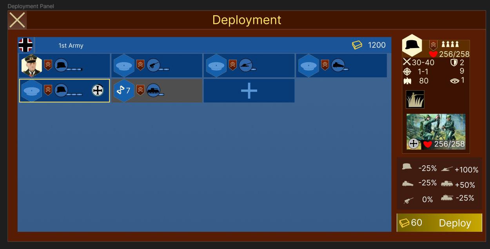

### 随机剧本生成

- 地图产生：从已有地图中随机选择 14x14 ~ 20x20 区域，其至少有2个城市，2个工厂。（如果地图只需要标记每格地形再利用 Auto Tile 之类的机制而不需要进一步人工的话，可以考虑更进一步的随机生成。）
    - 样例采样方式
        - 从筛选过的地图池（主要陆地且长宽大于等于14）中随机抽一个
        - 由地图总大小截断，均匀采样长宽： $H\sim U(14, MapHeight), \min(20, MapHeight)), W \sim U(14, \min(20, MapWidth))$ 
        - 取其中一个随机城市为中心做一个框，施加 $U(0,H/2), U(0,W/2)$的偏移。当框超出地图时，以最小偏移将其“推回”地图上。
        - 若此框中包含至少2个城市和工厂，且城市之间的最大距离大于等于10时，使用该框，否则重复直至抽出为止。
- 敌对国家产生：剧本敌对国家仅有一个。其概率由下表指定：

|        | 法国 | 意大利 | 英国 | 日本 | 美国 | 德国 | 苏联 |
| ------ | ---- | ------ | ---- | ---- | ---- | ---- | ---- |
| 法国   | 0%   | 30%    | 0%   | 5%   | 0%   | 60%  | 5%   |
| 意大利 | 10%  | 0%     | 40%  | 0%   | 40%  | 0%   | 10%  |
| 英国   | 0%   | 35%    | 0%   | 20%  | 0%   | 35%  | 10%  |
| 日本   | 5%   | 0%     | 20%  | 0%   | 70%  | 0%   | 10%  |
| 美国   | 0%   | 15%    | 0%   | 35%  | 0    | 40%  | 10%  |
| 德国   | 10%  | 0%     | 20%  | 0%   | 20%  | 0%   | 50%  |
| 苏联   | 5%   | 0%     | 5%   | 10%  | 5%   | 75%  | 0%   |

（例：法国行意大利列的 30% 表示法国为玩家控制时，由30%概率敌对国家为意大利。）

- 任务类型产生，75%进攻，25%防御。
    - 具体目标产生：
        - 进攻时50%目标为歼灭所有敌人，50%目标为占领所有城市。
        - 防守的目标为50%为守住一开始的占据的所有城市，50%为守住至少一个城市。
- 初始建筑分配
    - 选择最大距离的城市对（多个距离相等时随机选一组），其中一个分配给玩家（优先分配更靠近角落的），另一个分配给敌方。
    - 进攻时，玩家初始城市4格内的建筑归玩家，其余建筑归敌方。
    - 防守时，根据与双方初始城市距离大小分配给双方。
- 影响力图（[influence map](https://www.gameaipro.com/GameAIPro2/GameAIPro2_Chapter30_Modular_Tactical_Influence_Maps.pdf)）控制区
    - 虽然游戏没有追踪建筑格以外的归属，但出于计算的考虑这里计算一种类似归属的值。
    - 双方建筑“放出”影响力。根据格子上双方格子影响力大小决定格子的影响力控制区。
    - 具体影响力图计算方式和参数化方法有很多，不过结果大同小异。样例计算方式：
        - 一方在一格的影响力 = 该方所有建筑在该格的影响力和
        - 一方的一个建筑到一格的影响力 = $k_i N(d;\mu,\sigma^2)$，其中 $N(d;\mu,\sigma)$ 为参数为 $\mu,\sigma$ 的正态分布密度函数（默认可取 $\mu=0, \sigma=1$ ），d为格子距离， $k_i$ 为建筑类型的影响力系数。
        - 影响力系数：
            - 城市：3
            - 工厂/机场：2
            - 其他建筑：1
- 玩家可部署区域
    - 玩家可在控制的城市，工厂，机场格，若其邻格为影响力控制区，则也可部署。

#### 进攻任务

##### 兵力类型分配

- 每个控制的城市以及控制区内的邻格放置一个单位，其中，分为三个类型：
    - 城市格
    - 城市前方：邻格中影响力大于等于城市格内影响力的格子
    - 城市后方：邻格中影响力小于城市格内影响力的格子
- 三个类型按下表独立抽取兵种

| 类型       | 步兵 | 装甲车 | 炮兵 | 坦克 | 重炮 | 重坦 | 无单位 |
| ---------- | ---- | ------ | ---- | ---- | ---- | ---- | ------ |
| 城市       | 40%  | 0%     | 0%   | 20%  | 0%   | 40%  | 0%     |
| 城市前方   | 50%  | 20%    | 0%   | 15%  | 0%   | 10%  | 5%     |
| 城市后方   | 5%   | 5%     | 35%  | 5%   | 30%  | 10%  | 10%    |
| 孤立工厂   | 25%  | 15%    | 5%   | 15%  | 0%   | 15%  | 25%    |
| 孤立机场   | 50%  | 15%    | 0%   | 5%   | 0%   | 5%   | 25%    |
| 防御线前方 | 50%  | 10%    | 0%   | 15%  | 0%   | 0%   | 25%    |
| 防御线后方 | 10%  | 5%     | 25%  | 10%  | 15%  | 10%  | 25%    |

- 城市分配后，尚未被分配的工厂与机场（即不在城市邻格的工厂/机场）按孤立工厂/机场决定类型。
- 防御线
    - 敌方控制区内存在若干防御线
    - 一条前线防御线
        - 前线防御线前方为敌对控制区中与玩家控制区相邻的格子（即控制区边界）
        - 前线防御线后方为敌对控制区中与防御线前方相邻且不为防御线前方的格子（即控制区边界内一层）
    - 零或数条纵深（等势）防御线
        - 纵深防御线前方为敌对控制区中玩家影响力小于给定值的区域的边界（类似上面定义）
        - 纵深防御后方类似前线防御线后方定义。
    - 计算前线防御线前方与敌对初始城市的最短路线，每5格距离产生1纵深防御线。阈值取为最短路径对应格上的影响力值。
- 防御线内分配
    - 按前线防御线前方，前线防御线后方，最靠近前线的纵深防御线前方，最靠近前线的纵深防御线后方。。的顺序采样
    - 各层采样独立
    - 若采样位置已有单位（卫戍单位等）则不采样保持原值
    - 层内相关性：层内采样并非独立。按任意顺序进行，当采样时附近没有本层的采样值时，按上表采样。若有，则50%概率随机重复其中一个的类型（从而步兵，坦克等倾向于成团出现而非混杂在一起）

假设地图上有左中右三城，上述规则效果如图所示：

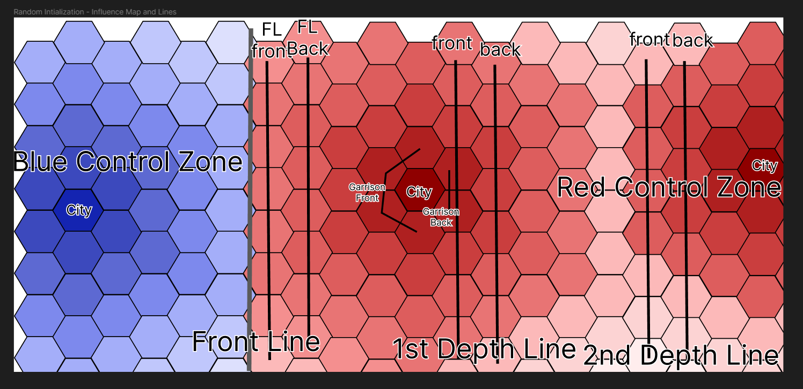

##### 属性分配

兵种分配完后，开始独立分配将军，特种部队，编数，工事。

- 单位是有将军概率
    - 基准
        - 初始城市中的单位：100%
        - 城市中的单位：50%
        - 工厂/机场中的单位：10%
        - 其余：5%
    - 坦克单位：+5%
    - 重炮单位：+20%
    - 重坦单位：+20%
- 将军抽取：所有将军以对应兵种技能值为权重进行抽取，其中初始城市中的将军仅从三四星将军中进行抽取。
- 将军晋升等级抽取：按将军可晋升等级 0~n 等概率取值。初始城市在未达到最大值时再+1。
- 单位是否有特种部队
    - 基准
        - 有将军：100%
        - 无将军：20%
    - 步兵：+10%
- 特种部队抽取：所有与兵种相容的特种部队中等概率抽取（步兵以50%概率从普通特种部队中等概率抽取）
- 特种部队增强抽取：与特种部队类型相容的 0~n 中等概率抽取。初始城市在未达到最大值时再+1.
- 编数确定
    - 有将军：满编
    - 否则按兵种无将军时可拥有的编数 1~n 等概率抽取。建筑中的单位在未满编时再+1.
- 工事类型
    - 在所有有步兵单位部署且可以建造工事的区域判定是否存在工事以及类型
    - 处在城市前方或防御线前方的步兵单位位置有10%概率等概率出现战壕，10%概率出现要塞，10%概率出现要塞炮。
    - 处在城市后方或防御线后方的步兵单位位置有20%概率出现要塞炮，5%概率出现雷达。
    - 拥有工兵类型特种部队的单位以上概率x3。

##### 资产分配

- 计算敌方部署的所有单位的总经济值（不受玩家面临的补给与补充修正影响）与生涯模式总补给值。
- 敌方每回合获得敌方总经济值的5%收入，初始有敌方总单位经济值的20%经济。
- 玩家每回合获得敌方总经济值为 1%~2.5% 的经济收入（初始化时随机决定后，战斗中始终获得此收入），初始拥有敌方总单位经济值的5%~10%的经济（初始化时决定）。
- 玩家获得 30%~60% 的敌方生涯模式总补给值的补给值（初始化时采样决定）。
- 生涯模式的第n个战斗中，经济收入，初始经济总补充受到 -(n-1) * 5% 的修正（如第二关三项资源-5%，第八关-35%）。 

##### 政治点，回合与目标

- 总回合 = 5 + 敌对城市数+ 双方初始城市距离 / 2 + 防御线数 * 4
- 完成目标奖励：100 + 总回合 * 10 政治点
- 每回合固定损失的政治点数：敌对城市数 + 5
- 城市不产生经济收入（将军的经济技能除外），但每个敌对城市每回合产生 1 政治点（抵消对应的政治点固定损失）。
- 单位被消灭时损失之前表中的政治点，敌对单位被消灭时增加1/3于该值的政治点，随机取整（如增加1.3时，为30%概率增加2，70%概率增加1）。

#### 防守任务

WIP...

### 战斗结束与生涯状态

- 和普通战役一样，战斗中达成目标为成功，否则为失败。
- 无论成功失败，均保持单位和政治点状态，进入下一关卡。
- 成功的关卡在主界面标记为勾，失败的关卡标记为叉。
- 成功和失败的区别的直接区别仅为成功会取得对应的达成目标政治点奖励，失败除了无政治点数外无其他惩罚。
- 间接地，进攻失败意味着承担进攻任务的回合固定政治点损失。防守失败则丢失了防守每回合的固定政治点增加。
- 如前所述，战斗结束时会发完当前关卡应发放还未发放的卡牌。
- 关卡结束时，按关卡开始前的政治点和利率（表示资产留给上级的战略优势）之积，随机取整后加入政治点。

### 提前撤退

- 右上角用于打开重启，设置，退出的按钮中的重启按钮改为撤退，其在进攻中表示主动放弃攻势，防守时表示主动放弃防御目标。

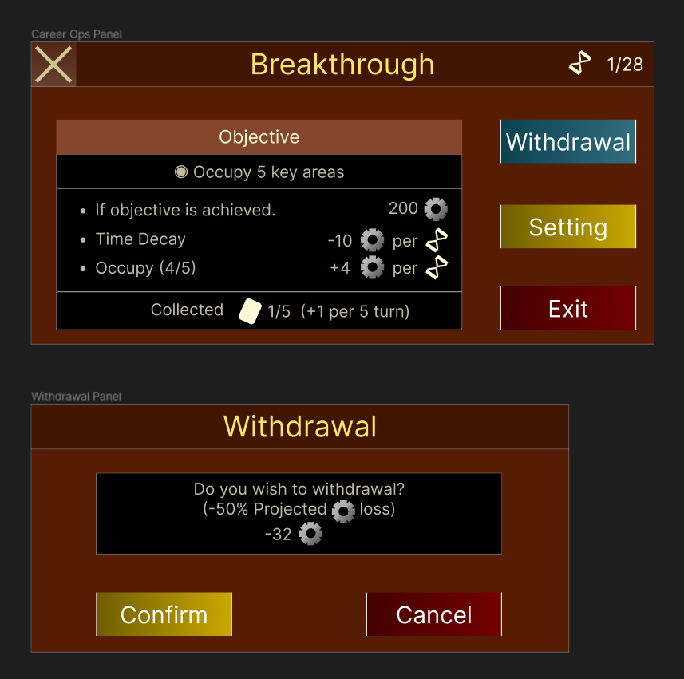

- 提前撤退视作失败，所以不能取得目标达成政治点奖励。
- 进攻任务中提前撤退，按每回合固定损失的政治点数加占领城市政治点之和 * 剩余回合数 的 50% 扣除政治点数。
    - 例：玩家应攻略5个城市，剧本有23回合，玩家在15回合时占领2个城市发现已无力继续攻击。由 ((-10 + 2) * (23-15)) * 0.5 = -32，则该任务记作失败且扣除32政治点。这比它待机拖到回合限制结束剧本损失的64政治点更优。
- 由单位全灭导致的失败视作提前撤退。

## 胜利条件

- 生涯模式主界面右边会列出小胜和大胜的条件，最后一关结束时的政治点数是否大于给定值时达成对应的胜利条件。
- 小胜时取得基准奖励。大胜时取得+20%的奖励。未取得胜利时无奖励
- 奖励使用标准的获得徽章的界面。
- 最后一关结束后并不自动重置，玩家可以查看过往的胜负情况（截图等）。为了开新的一局玩家需用主界面的重置按钮手动重置。

## 初始资产

- 初始单位：初始化时，在所有剧本确定后，玩家按求援单位的生成规则不断获得随机单位。直到达到第一关敌方生涯模式总补给值的 40% 为止（不考虑第一关的价格修正）。
- 初始政治点数：一开始有100政治点数。

